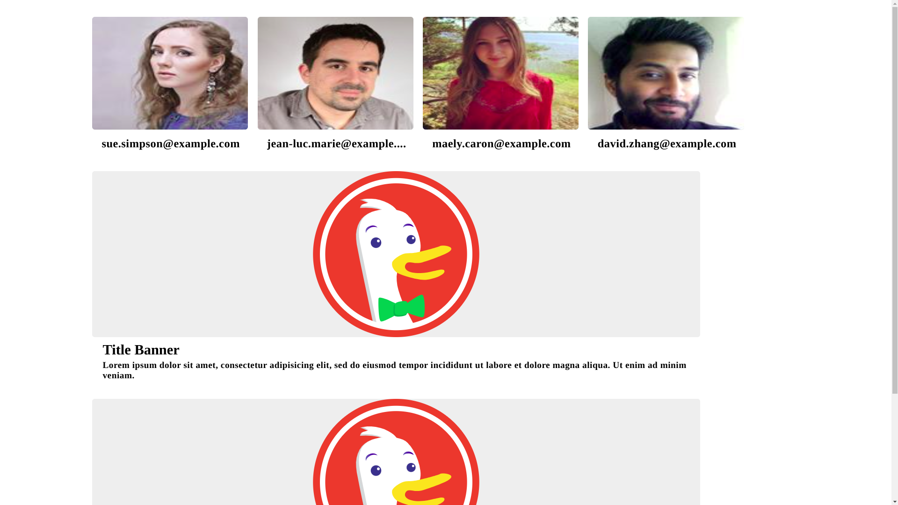

# nax-card

Card hecha en Vue usable como skeleton para experiencia de usuario y carta básica para imagen, datos. Sino se agrega nada el modo es Skeleton por defecto.

Vue 3 + Vite: This template should help get you started developing with Vue 3 in Vite. The template uses Vue 3 `

	

### Props

	img: String, default: ''

	noimg: Boolean

	notext: Boolean

	text: String

	type: String, default: 'card'
